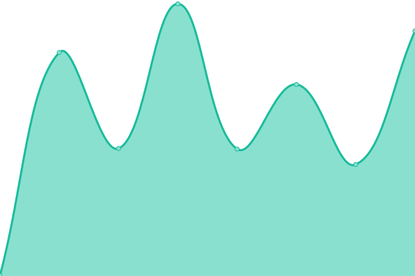

# [📈 Live Status](https://JaswanthRemiel.github.io/uptime): <!--live status--> **🟩 All systems operational**

This repository contains the open-source uptime monitor and status page for [Jaswanth Remiel AG](https://github.com/jaswanthremiel).

<!--start: status pages-->
<!-- This summary is generated by Upptime (https://github.com/upptime/upptime) -->
<!-- Do not edit this manually, your changes will be overwritten -->
<!-- prettier-ignore -->
| URL | Status | History | Response Time | Uptime |
| --- | ------ | ------- | ------------- | ------ |
|  [Portfolio](https://remiel.fyi) | 🟩 Up | [portfolio.yml](https://github.com/JaswanthRemiel/uptime/commits/HEAD/history/portfolio.yml) | 

 566ms
     
 | 

<a href="https://uptime.remiel.fyi/history/portfolio">100.00%</a>
    

|  [Tools](https://tools.remiel.fyi/) | 🟩 Up | [tools.yml](https://github.com/JaswanthRemiel/uptime/commits/HEAD/history/tools.yml) | 

 487ms
     
 | 

<a href="https://uptime.remiel.fyi/history/tools">100.00%</a>
    

|  [Blog](https://remiel.fyi/blog) | 🟩 Up | [blog.yml](https://github.com/JaswanthRemiel/uptime/commits/HEAD/history/blog.yml) | 

 187ms
     
 | 

<a href="https://uptime.remiel.fyi/history/blog">100.00%</a>
    

<!--end: status pages-->

[**Visit our status website →**](https://JaswanthRemiel.github.io/uptime)
